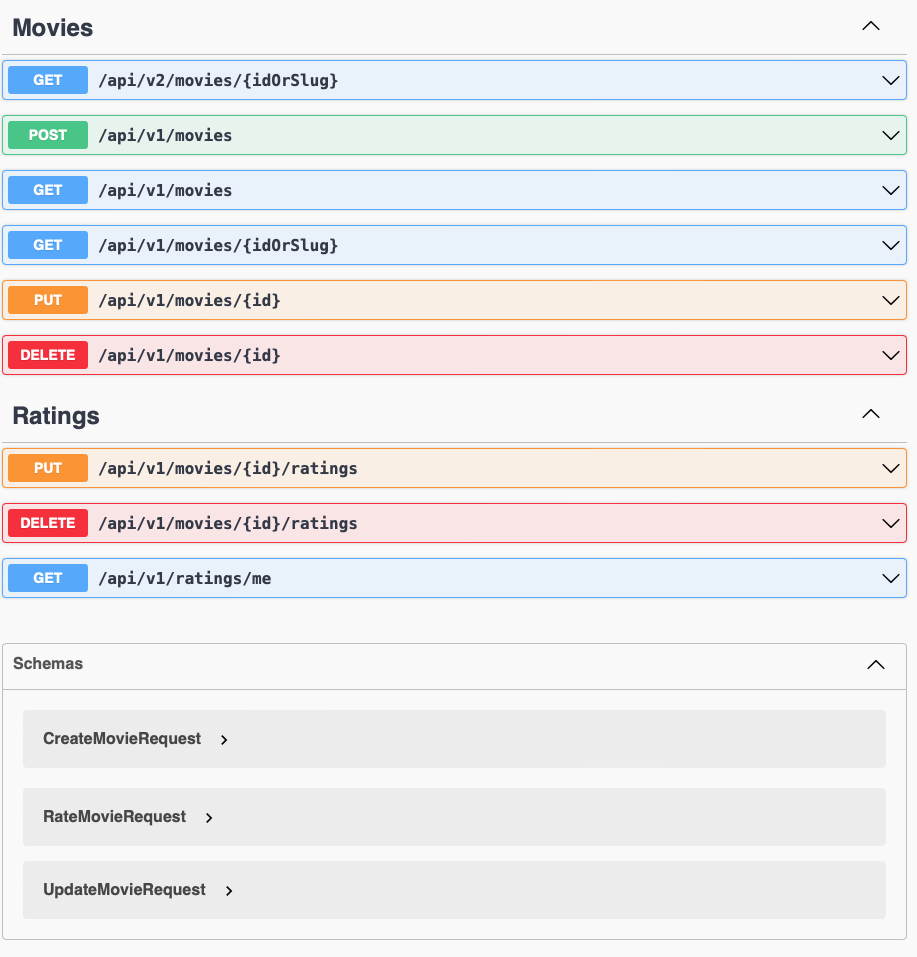

# API pour Stocker, consommer et noter une base de donnée de films

Version .NET 8

## Installation

```bash
# après avoir cloné le projet
docker compose up -d # contient un service postgresql
dotnet run --project src/Movies.Api/
```

Swagger disponible à [localhost:5015/swagger/index.html](http://localhost:5015/swagger/index.html)



## Features

- CRUD Movies
  - Authorization et gestion des Policies pour la suppression, l'update et la création
- Recherche, filtre et pagination sur la lecture des items Movies
- CRUD Ratings
  - Authorization
- Middleware de gestion des erreurs
- Versioning
- Test unitaire sur les modèles de Movies.Core

## Tools

- Dapper
- FluentValidation
- Npgsql
- FluentAssertions

## Auteur

Louisan Tchitoula:

- [LinkedIn](https://www.linkedin.com/in/louisan-tchitoula/)
